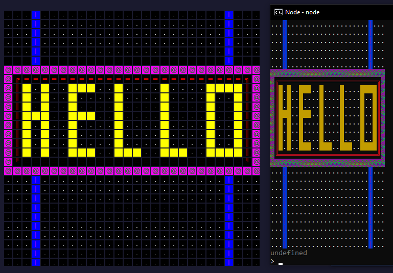
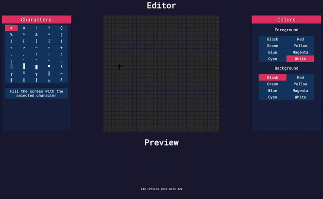

# AsciiPainter
You can draw your own ASCII arts with different colors and characters, the colors are generated by using ANSI escape codes. [https://mihaszki.github.io/AsciiPainter/](https://mihaszki.github.io/AsciiPainter/)

